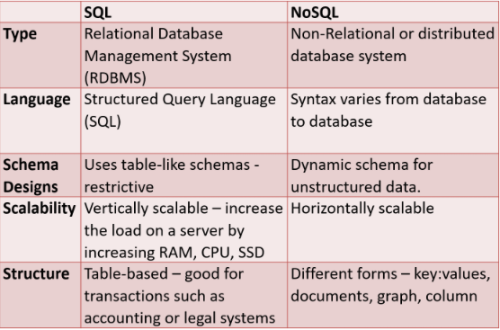
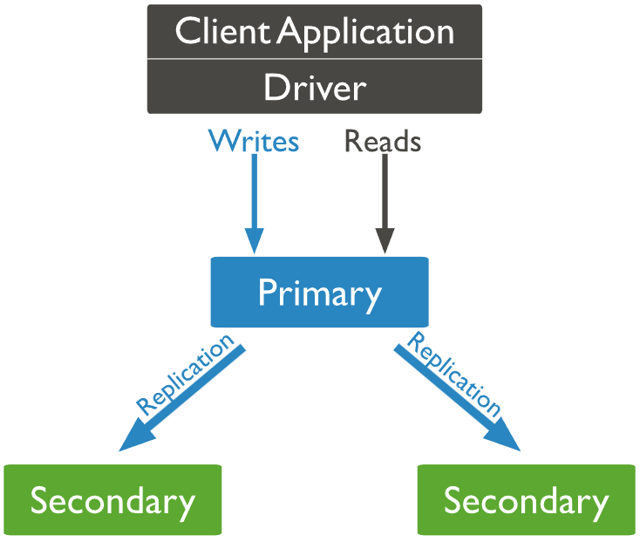

# MongoDB

MongoDB is a **NoSQL**, open-source, document-oriented database. It stores data in flexible, JSON-like **documents** using BSON (Binary JSON). Unlike traditional relational databases, MongoDB does not require a fixed schema and is highly scalable both vertically and horizontally.



---

## Collections and Documents

- **Document**: A JSON-like object storing data in key-value pairs.
- **Collection**: A group of documents, similar to a table in SQL.

MongoDB supports both **embedded** (denormalised) and **referenced** (normalised) data models.

### Embedded Document (1-to-1 or 1-to-Many):


### Referenced Document (Many-to-Many):


---

## MongoDB Architecture

### Components:

- **mongod**: Main server daemon that stores data and handles queries.
- **mongos**: Query router for sharded clusters.
- **Storage Engine**: Manages how data is stored to disk.
- **Drivers**: Interface used by apps to communicate with MongoDB.

MongoDB supports sharding for distributed storage and replica sets for high availability.

---

## Replica Sets

A **Replica Set** is a cluster of MongoDB servers that maintain the same dataset.

- One **Primary** node handles writes.
- Multiple **Secondary** nodes replicate the data.
- If the primary fails, one of the secondaries is elected as the new primary automatically.

### Replica Set Diagram



### Advantages:

- High availability
- Automatic failover
- Redundancy and data recovery
- Optional read scaling (via secondaries)

### Disadvantages:

- Replication lag possible
- More complex setup and resources required

---

## Sharding

**Sharding** is MongoDB’s solution for horizontal scaling — distributing data across multiple machines to support large datasets and high read/write loads.

### How It Works:

- A **shard key** determines data distribution.
- **Shards** store different portions of the dataset.
- **mongos** routes queries to the appropriate shard.
- **Config servers** store metadata about the cluster.

### Sharding Diagram


### Advantages:

- Supports large-scale deployments
- Improved read/write throughput
- Horizontal scalability

### Disadvantages:

- Choosing the right shard key is critical
- Increased operational complexity
- Rebalancing can be costly

---

## MongoDB Use Cases

### Case Study 1: **Uber**

Used MongoDB to manage geospatial data and real-time tracking. The flexible document model and write throughput supported dynamic driver/passenger interactions globally.

### Case Study 2: **MetLife**

Used MongoDB to consolidate data from 70+ systems into one unified platform, creating a 360-degree customer view and enhancing service quality.

---

## Class Notes Summary

### MongoDB Basics (`mongosh`)

```bash
# Create a database
use sparta

# Create a collection
db.createCollection('academy')

# Insert a single document
db.academy.insertOne({name: 'new document'})

# Insert multiple documents
db.academy.insertMany([
  {"course": "Data Engineering", "length": 10},
  {"course": "Data Analysis", "length": 8}
])

# Insert a document about yourself
db.academy.insertOne({
  name: 'Mahdi Alom',
  Age: '23',
  Height: '178cm',
  'Hair colour': 'Black'
})

# Embedded document
db.academy.insertOne({
  name: 'David',
  course: 'Data Engineering',
  trainer: {name: 'Luke', Expertise: 'Data'}
})

# Validation example
db.getCollectionInfos({name: 'students'})

# Show collections and data
show collections
db.students.find({})

# Update
db.favouriteFilms.updateOne({movie: 'Norbit'}, {$set: {release_date: '2002'}})

# Delete
db.favouriteFilms.deleteOne({movie: 'Elf'})
db.favouriteFilms.deleteMany({movie: 'Elf'})
```

> **Note**: All numbers are stored as floating-point by default. Use `NumberInt()` or `NumberLong()` to store as integers.

---

## Further Queries

### Query Documents

```bash
# Find specific fields
db.characters.find({name: 'chewbacca'}, {name: 1, eye_color: 1})

# Find embedded fields
db.characters.find({name: 'chewbacca'}, {'species.name': 1})

# Filter by eye color
db.characters.find({eye_color: {$in: ['yellow', 'orange']}}, {name: 1})

# Combined condition with $and/$or
db.characters.find({
  $or: [
    { $and: [{ gender: 'female' }, { eye_color: 'blue' }] },
    { $and: [{ gender: 'male' }, { eye_color: 'yellow' }] }
  ]
})
```

### Data Cleaning & Transformation

```bash
# Remove height field if "unknown"
db.characters.updateMany({height: "unknown"}, {$unset: {height: ""}})

# Convert height to integer
db.characters.updateMany({}, [{$set: {height: {$toInt: "$height"}}}])

# Clean up mass and convert to double
db.characters.update({mass: "1,358"}, {$set: {mass: "1358"}})
db.characters.update({mass: "unknown"}, {$unset: {mass: ""}}, {multi: true})
db.characters.update(
  {mass: {$exists: true}},
  [{$set: {mass: {$toDouble: "$mass"}}}],
  {multi: true}
)
```

### Aggregation Example

```bash
# Average mass by species
db.characters.aggregate([
  { $match: { mass: { $ne: null } } },
  {
    $group: {
      _id: "$species.name",
      averageMass: { $avg: "$mass" },
      count: { $sum: 1 }
    }
  },
  { $sort: { averageMass: 1 } }
]).toArray()
```

---

## Referencing Documents with ObjectId

In MongoDB, we can reference documents across collections using their `_id` field (which is an `ObjectId`). This is useful for representing relationships like **characters** being pilots of **starships**.

### Step 1: Find the `_id` of a document

Before inserting a starship, you should retrieve a character’s ID:

```bash
# Find the ObjectId for Darth Vader
db.characters.find({name: "Darth Vader"}, {_id: 1})
```

---

### Step 2: Insert a document that references another using ObjectId

Now that you have the ID, use it to reference Darth Vader as the pilot of his spaceship:

```bash
# Insert Darth Vader's ship with a single ObjectId reference
db.starships.insertOne({
  name: "TIE Advanced x1",
  model: "Twin Ion Engine Advanced x1",
  manufacturer: "Sienar Fleet Systems",
  length: 9.2,
  max_atmosphering_speed: 1200,
  crew: 1,
  passengers: 0,
  pilot: ObjectId("6888a37066d2c0566b90f8fe")
})
```

---

### Step 3: Find multiple characters and reference all their IDs

If a ship has multiple pilots, like the Millennium Falcon, you can find their IDs first:

```bash
# Get the ObjectIds of all key pilots
db.characters.find(
  {name: {$in: ["Chewbacca", "Han Solo", "Lando Calrissian", "Nien Nunb"]}},
  {_id: 1}
)
```

Then use those IDs to insert a new starship:

```bash
# Insert Millennium Falcon with multiple pilots
db.starships.insertOne({
  name: "Millenium Falcon",
  model: "YT-1300 Light Freighter",
  manufacturer: "Corellian Engineering Corporation",
  length: 34.37,
  max_atmosphering_speed: 1050,
  crew: 4,
  passengers: 6,
  pilot: [
    ObjectId("6888a37066d2c0566b90f8bc"),
    ObjectId("6888a37066d2c0566b90f8e1"),
    ObjectId("6888a37066d2c0566b90f8f3"),
    ObjectId("6888a37066d2c0566b90f8fd")
  ]
})
```

> Using `ObjectId` is best practice when creating **references between collections**, especially in a normalised MongoDB schema.
