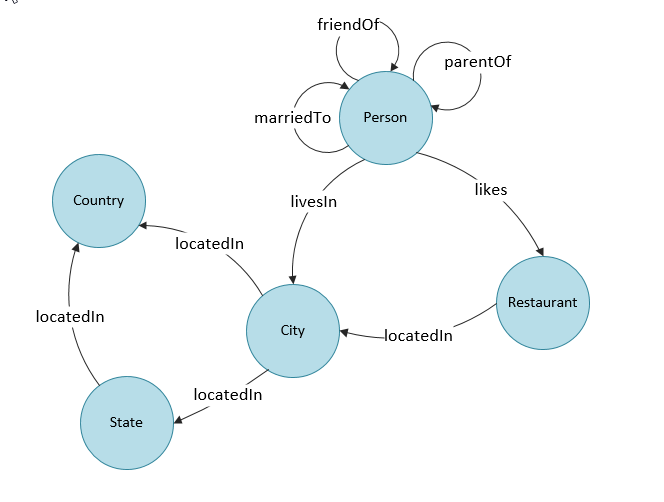

# MongoDB Assessment Revision Notes

---

## Table of Contents

1. [NoSQL Database Types](#1-nosql-database-types)
2. [Querying](#2-querying)
3. [Normalisation vs Denormalisation](#3-normalisation-vs-denormalisation)
4. [Database Scaling](#4-database-scaling)
5. [Graph Databases](#5-graph-databases)
6. [Relationships in MongoDB](#6-relationships-in-mongodb)
7. [Mongosh Commands](#7-mongosh-commands)
8. [MongoDB Architecture](#8-mongodb-architecture)
9. [Replica Sets](#9-replica-sets)
10. [Sharding](#10-sharding)
11. [.aggregate()](#11-aggregate)
12. [\_id Field](#12-_id-field)

---

## 1. NoSQL Database Types

There are several types of NoSQL databases, each suited to different use cases.

- **Document Store** → e.g. MongoDB  
  Stores data in JSON-like documents. Flexible schema.
- **Key-Value Store** → e.g. Redis  
  Stores values accessed via keys. Very fast.
- **Column-Family Store** → e.g. Cassandra  
  Stores data in columns instead of rows.
- **Graph Database** → e.g. Neo4j  
  Uses nodes and edges to represent data and relationships.


---

## 2. Querying

MongoDB uses the `find()` method for reading documents.

### Common Operators:

```bash
$eq     # Equal to
$ne     # Not equal
$gt     # Greater than
$gte    # Greater than or equal to
$lt     # Less than
$lte    # Less than or equal to
$in     # Matches any value in array
$nin    # Not in array
```

### Examples:

```bash
# Equal
db.collection.find({ age: { $eq: 25 } })

# Not Equal
db.collection.find({ status: { $ne: "inactive" } })

# Greater Than / Greater Than or Equal
db.collection.find({ age: { $gt: 25 } })
db.collection.find({ age: { $gte: 25 } })

# Less Than / Less Than or Equal
db.collection.find({ age: { $lt: 25 } })
db.collection.find({ age: { $lte: 25 } })

# In / Not In
db.collection.find({ status: { $in: ["active", "pending"] } })
db.collection.find({ status: { $nin: ["cancelled", "archived"] } })
```

---

## 3. Normalisation vs Denormalisation

- **Normalisation**: Data is split into separate collections and linked using `_id`. Reduces redundancy. Good for write-heavy applications.
- **Denormalisation**: Embeds related data in one document. Improves read performance. Suited for read-heavy applications.

---

## 4. Database Scaling

- **Vertical Scaling**: Add more resources to a single server.
- **Horizontal Scaling**: Distribute data across multiple machines (**sharding** in MongoDB).

---

## 5. Graph Databases

Graph databases store data using **nodes** (entities) and **edges** (relationships). Useful for analysing complex relationships.

### Example Use Cases:

- Social media connections
- Fraud detection
- Location networks
- Recommender systems

### Diagram:



---

## 6. Relationships in MongoDB

### Embedded Document Example (Denormalised):

- **Embedded Documents**: Best for 1-to-1 or 1-to-many, better for reads.

Explanation:
In this example, the trainer object is embedded directly inside the academy document.
This is good when the trainer is only relevant to this document and unlikely to be reused elsewhere.

```bash
db.academy.insertOne({
  name: "Mahdi",
  course: "Data",
  trainer: {
    name: "Luke",
    expertise: "Cloud"
  }
})
```

### Referencing Documents Example (Normalised):

- **Referenced Documents**: Best for many-to-many, reduces redundancy.

Explanation:
Here, Darth Vader is stored in a separate collection (characters),
and the starship document stores only the \_id of that character.
This allows multiple starships or data points to reference the same character without duplication.

```bash
db.characters.insertOne({ name: "Darth Vader" })

db.starships.insertOne({
  name: "TIE Advanced x1",
  pilot: ObjectId("6888a37066d2c0566b90f8fe")
})
```

---

## 7. Mongosh Commands

```bash
show dbs                     # List all databases
use myDB                     # Switch to/create a DB
show collections             # List collections
db.createCollection("academy")  # Create collection

db.academy.insertOne({ name: "Mahdi", course: "Data", age: 23 }) # Insert one

db.academy.insertMany([
  { name: "Mahdi", course: "Data", age: 23 },
  { name: "Luke", course: "Cloud", age: 30 },
  { name: "Aloo", course: "DevOps", age: 2 }
])

db.academy.find()                        # Find all

db.academy.updateOne({ name: "Mahdi" }, { $set: { age: 23 } })

db.academy.deleteOne({ name: "Mahdi" })  # Delete one
```

> Numbers are stored as `double` by default. Use `NumberInt()` or `NumberLong()` for specific types.

---

## 8. MongoDB Architecture

- **mongod**: Database server (stores data, handles queries).
- **mongos**: Router for sharded clusters.
- **Shards**: Hold portions of data (for horizontal scaling).
- **Config Servers**: Store metadata about shard distribution.
- **Replica Set**: Group of nodes (1 primary, many secondaries) for redundancy.

---

## 9. Replica Sets

- Provide high availability and data redundancy
- One **Primary** node for writes
- One or more **Secondary** nodes that replicate from primary
- Supports automatic failover


---

## 10. Sharding

Sharding distributes data across multiple servers for scalability.

- **Shard key** determines partitioning
- **mongos** routes queries to appropriate shards
- **Config servers** store metadata


---

## 11. .aggregate()

Used for data analysis and transformation. Supports multiple stages.

### Example:

##### Explanation:

In this `.aggregate()` example, we are using a pipeline with three stages to analyse character mass by species:

1. **`$match`** filters the documents to exclude those where `mass` is `null` — we only want valid mass values.
2. **`$group`** groups the remaining documents by `species.name`, then calculates two things:
   - `averageMass`: the average of all `mass` values in each group using `$avg`
   - `count`: the number of documents in each group using `$sum`
3. **`$sort`** then orders the output by `averageMass` in ascending order.

This type of pipeline is useful for producing summary statistics, such as averages or totals, grouped by a specific field.

```bash
db.characters.aggregate([
  { $match: { mass: { $ne: null } } },
  {
    $group: {
      _id: "$species.name",
      averageMass: { $avg: "$mass" },
      count: { $sum: 1 }
    }
  },
  { $sort: { averageMass: 1 } }
])
```

### Common Stages:

- `$match`: Filters documents
- `$group`: Groups data
- `$sort`: Sorts results
- `$project`: Select specific fields
- `$limit`: Limits result count

---

## 12. `_id` Field

- Every document has a unique `_id`
- Automatically generated if not provided
- Can be used for referencing across collections

### Example:

##### Explanation:

In this `_id` example, we first use `find()` to retrieve the `_id` value of the character named Darth Vader.
This is helpful when we need to reference a specific character's ID in another collection (such as `starships`).

The second query uses `insertOne()` to add a new starship, the Millennium Falcon, and links it to multiple characters by referencing their unique `_id` values using `ObjectId()`.
These ObjectIds should have been retrieved beforehand using the first type of query.

Referencing documents in this way creates a relationship between collections (e.g. linking pilots to starships) while keeping the data clean and normalised.

```bash
# Find the ObjectId for Darth Vader
db.characters.find({name: "Darth Vader"}, {_id: 1})

# Reference multiple pilots by _id
db.starships.insertOne({
  name: "Millennium Falcon",
  pilot: [
    ObjectId("6888a37066d2c0566b90f8bc"),
    ObjectId("6888a37066d2c0566b90f8e1")
  ]
})
```

---

_Finalised for the MongoDB Multiple Choice Assessment – Good luck!_
